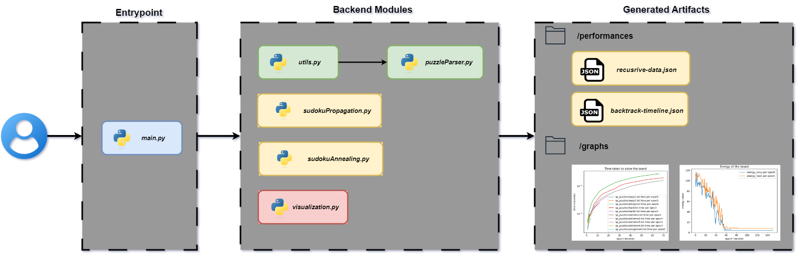
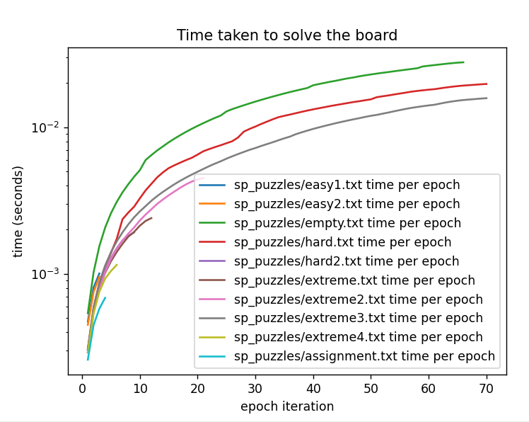
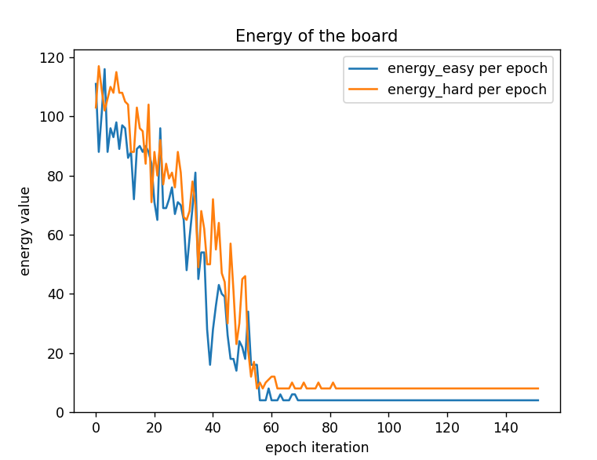
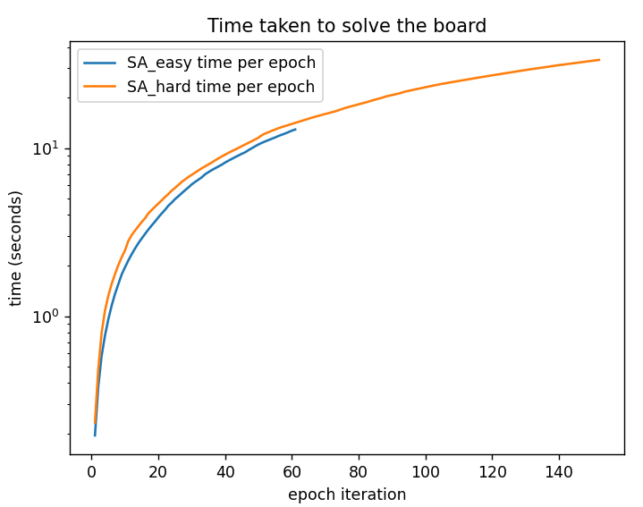

# Sudoku AI System 🧩

> An Intelligent Sudoku Solver implementing Backtracking and Simulated Annealing Algorithms

[](https://www.python.org/)
[](https://en.wikipedia.org/wiki/Simulated_annealing)
[](https://en.wikipedia.org/wiki/Backtracking)
[](LICENSE)

## 📑 Table of Contents

- [Overview](#-overview)
- [Features](#-features)
- [Getting Started](#-getting-started)
- [Configuration Guide](#-configuration-guide)
- [Adding Custom Puzzles](#-adding-custom-puzzles)
- [System Architecture](#-system-architecture)
- [Performance Analysis](#-performance-analysis)
- [Technical Documentation](#-technical-documentation)

## 🎯 Overview

Developed during my exchange studies in Italy (October 2024), this advanced Sudoku solving system showcases the power of artificial intelligence through two distinct approaches:

- **Backtracking with Constraint Propagation**: A systematic depth-first search strategy
- **Simulated Annealing**: An optimization algorithm inspired by metallurgical annealing

The system demonstrates how AI can simulate human-like problem-solving through trial, error, and learning from past experiences.

## ✨ Features

- **Dual Solving Algorithms**:
  - 🔍 Backtracking with constraint propagation
  - 🧪 Simulated annealing optimization
- **Flexible Configuration**:
  - Multiple puzzle execution modes
  - Customizable solving parameters
- **Performance Analytics**:
  - Real-time solving metrics
  - Comparative algorithm analysis
- **Visual Insights**:
  - Performance graphs
  - Solution visualization

## 🚀 Getting Started

### Prerequisites
- Python 3.8+
- Required packages (see `requirements.txt`)

### Quick Start
1. Clone the repository
2. Configure settings in `utils.py`
3. Run `main.py`

## ⚙️ Configuration Guide

The system offers flexible configuration through `utils.py`:

| Parameter | Type | Description | Options |
|-----------|------|-------------|----------|
| `runBacktrackConstraintAlgorithm` | Boolean | Algorithm selection | `True`: Backtracking, `False`: Simulated Annealing |
| `OPTION` | Integer | Execution mode | `1`: Single puzzle, `2`: Two puzzles, `3`: Multiple puzzles |
| `SELECTED_PUZZLE` | String | Single puzzle path | Active when `OPTION=1` |
| `EASY_HARD_PUZZLES` | Dict | Two puzzle paths | Active when `OPTION=2` |
| `SELECTED_PUZZLES_LIST` | List | Multiple puzzle paths | Active when `OPTION=3` |

### 🎮 Demo Configurations

#### Backtracking & Constraint Propagation

**Single Puzzle Mode:**

*Solving a single puzzle using backtracking*

**Dual Puzzle Mode:**

*Comparative analysis of two puzzles*

**Multi-Puzzle Mode:**

*Batch processing of multiple puzzles*

#### Simulated Annealing

**Optimization Process:**

*Temperature-based optimization in action*

## 📝 Adding Custom Puzzles

### Supported Formats

```python
# Format 1: Simple Grid
0 0 0 0 0 0 0 0 0
0 0 0 0 0 0 0 0 0
...

# Format 2: Subgrid Separation
5 3 . |. 7 . |. . .
6 . . |1 9 5 |. . .
...
```

### Format Rules
- Empty cells: Use `.` or `0`
- Cell separation: Single space
- Subgrid boundaries: `|` (optional)
- Grid size: 9x9

## 🏗 System Architecture


*System data flow and component interaction*

### 📦 Core Components

- **`main.py`**: System entry point and orchestrator
- **`utils.py`**: Configuration and utility functions
- **`visualization.py`**: Performance visualization engine
- **`sudokuPropagation.py`**: Backtracking implementation
- **`sudokuAnnealing.py`**: Simulated annealing implementation
- **`puzzleParser.py`**: Input processing module

### 📂 Directory Structure

```
sudoku-ai/
├── puzzles/         # Puzzle input files
├── performances/    # Performance metrics
└── graphs/         # Generated visualizations
```

## 📊 Performance Analysis

### Backtracking Results

*Comparative performance across puzzle complexity*

### Simulated Annealing Analysis

*Energy optimization over iterations*


*Time performance analysis*

## 🔧 Technical Documentation

### Puzzle Processing Pipeline

1. **Input Processing**
   ```python
   # Raw Input
   5 3 . |. 7 . |. . .
   ...
   
   # Subgrid Division
   53..7....6..195....98....6.
   ...
   
   # Final Format
   53..7....6..195....98....6.8...6...34..8.3..17...2...6.6....28....419..5....8..79
   ```

2. **Solution Generation**
3. **Performance Metrics Collection**
4. **Visualization Generation**

---

*Developed by Joel Mattsson during exchange studies at the University of Ca' Foscari, Italy, Venice*
